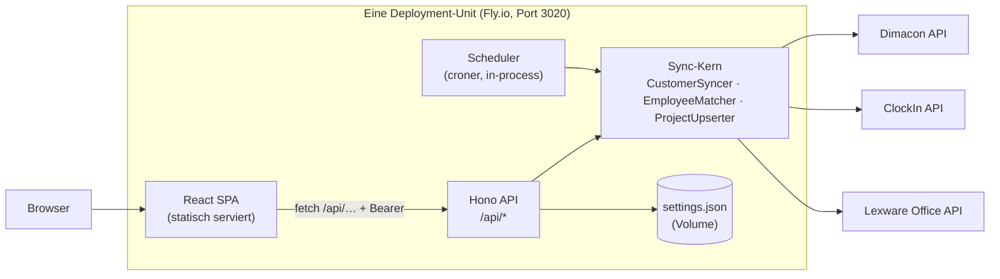
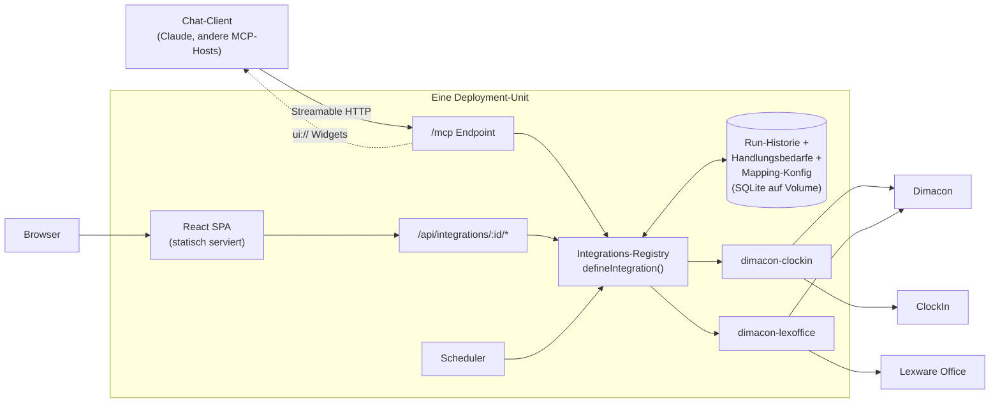

# Konzept: Sync-Tool als External App mit MCP-/Chat-Oberfläche und Widgets

> Status: Entwurf · Stand: 2026-08-11
>
> Ticket-Akzeptanzkriterien: (1) Architektur MCP-Server + Web-UI skizziert,
> (2) Wiederverwendung von Widgets/Oberflächen bewertet, (3) Single Deployment
> Unit vs. mehrere Deployments geprüft, (4) Sync-Jobs, Mapper-Konfiguration und
> Handlungsbedarf-Übersicht als UI-Konzept beschrieben.

## 1. Zusammenfassung

Das Sync-Tool (Dimacon → ClockIn/Lexware) wird zur „External App“: weiterhin
über die eigene Web-UI bedienbar, zusätzlich aber über eine Chat-/MCP-
Oberfläche mit Widgets — und perspektivisch als externer Dienst in Dimacon
registriert. Die vier Prüfaufträge werden wie folgt beantwortet:

1. **Architektur:** Ein MCP-Endpoint (`/mcp`, Streamable HTTP) wird in den
   bestehenden Hono-Prozess integriert; Fundament ist die Integrations-Registry
   (pro Integration fällt heute eine REST-Route ab, künftig zusätzlich ein
   MCP-Tool).
2. **Widget-Wiederverwendung:** Chat-Widgets werden mit dem MCP Apps SDK
   (`ui://`-Resources) gebaut und verwenden die extrahierten, rein
   präsentationalen SPA-Komponenten wieder. Das Widget-Framework des externen
   miranum-ai-MCP-Servers wird **nicht** angebunden (Stand heute: 0 Widgets,
   0 Pipelines registriert, Quellcode außerhalb dieses Repos).
3. **Deployment:** **Eine** Deployment-Unit (bestehendes Docker-Image, MCP als
   zusätzliche Route). Ein separater MCP-Service lohnt erst, wenn Persistenz
   und Scheduler aus dem Prozess wandern.
4. **UI-Konzept:** Sync-Jobs, Mapper-Konfiguration und Handlungsbedarf-
   Übersicht werden je als Datenmodell + SPA-Screen + Chat-Widget beschrieben.
   Voraussetzung sind drei heute fehlende Bausteine: Run-Historie,
   deklarative Mapping-Konfiguration und persistierte Handlungsbedarfe.

## 2. Ausgangslage (Ist-Architektur)

Der Service ist heute eine einzelne Deployment-Unit: Hono serviert `/api/*`
und die statisch gebaute React-SPA aus einem Prozess (Port 3020, ein
Docker-Image, Fly.io). Der Scheduler (`croner`) läuft in-process, die
Scheduler-Konfiguration liegt als `settings.json` auf einem Volume
(`SETTINGS_PATH`). Auth: WorkOS-PKCE im Frontend, JWT-Middleware (`jose`) vor
`/api/{clockin,dimacon,lexoffice,settings}`; `/api/sync` ist bewusst davor
gemountet — `POST /api/sync/run` nutzt stattdessen ein optionales Shared
Secret (`SYNC_WEBHOOK_SECRET`), `GET /api/sync/healthz` ist ein offener
Status-Endpoint.



Drei funktionale Lücken prägen das Zielbild — sie sind keine Randnotizen,
sondern genau die Datenbasis, die das UI-Konzept (Abschnitt 6) braucht:

- **Keine Run-Historie.** Ergebnisse geplanter Läufe werden verworfen
  (`scheduler.ts` ignoriert das `SyncResult`); es gibt keinerlei persistierten
  Zustand außer `settings.json`. Die UI kann nur das Ergebnis eines selbst
  angestoßenen Laufs anzeigen.
- **Hartkodierte Mappings.** Alle Feld-Zuordnungen stecken inline in den drei
  Syncer-Klassen (`src/server/sync/{customers,employees,projects}.ts`),
  inklusive Konstanten wie der Startzeit `07:30` (`time.ts`) und dem
  Ländercode `DE`. Es gibt keine Konfigurationsebene.
- **Keine persistierten Handlungsbedarfe.** Nicht zuordenbare Mitarbeiter,
  fehlende Kunden/Projekte, Nummern-Drift usw. existieren nur als flüchtiges
  `SyncError[]` einer einzelnen Response. Der Live-Check vom 2026-08-11 zeigt,
  wie nötig eine dauerhafte Übersicht ist: 61 Dimacon-Kunden mit leerer
  Kundennummer, 11 doppelt vergebene Nummern, 136 Namens-Duplikate, ClockIn-
  Kunden mit UUID-Identifiern und dreifach abweichende Nummern zwischen
  Dimacon/ClockIn/Lexware.

## 3. Zielbild: MCP-Server + Web-UI (AC 1)

**Empfehlung:** Der MCP-Server wird als zusätzlicher Endpoint im bestehenden
Hono-Prozess betrieben — `POST /mcp` (Streamable HTTP), implementiert mit dem
mcp-use-Framework (Referenz inkl. WorkOS-Auth-Pattern liegt im Repo unter
`.claude/skills/mcp-apps-builder/`). Es entsteht **kein** zweiter Service.

Fundament ist die Integrations-Registry (mit diesem PR auf die npm-Clients
gemergt): `defineIntegration({ id, name, description,
systems, requiredEnv, inputSchema, run })` plus Registry und generische Routen
(`/api/integrations/:id/run|healthz`, `GET /api/systems`). Diese Abstraktion
ist der Schlüssel, weil beide Oberflächen aus derselben Quelle entstehen:

- **REST** (für die SPA): pro Integration `run`/`healthz`, generischer
  Ergebnis-Fallback in der UI.
- **MCP** (für Chat-Clients): pro Integration ein Tool
  (`run_<integration-id>`, Input = dasselbe Zod-`inputSchema`), dazu
  Query-Tools (`list_runs`, `get_run`, `list_action_items`, …) und Widgets
  (Abschnitt 4).



Hinweise zur Umsetzung:

- Die Registry liegt seit diesem PR auf `main`-Kurs: die ursprünglich auf
  `@miranum/client-*` (Workspace) laufende Architektur wurde auf die
  publizierten `@miragon/client-*`-npm-Pakete umgestellt.
- Auth für MCP-Clients ist zu klären (Abschnitt 9): kurzfristig genügt ein
  statischer Bearer-Key analog `SYNC_WEBHOOK_SECRET`; sauber wäre der
  OAuth-Flow des MCP-Standards mit WorkOS als Identity Provider.
- Alternative „Sync-Logik in den bestehenden miranum-ai-MCP-Server umziehen“
  wurde verworfen: der Server lebt in einem anderen Repo, hat kein Job-/
  Scheduler-Konzept, und die Sync-Domänenlogik (Retry, Mutex, Dry-Run,
  Settings) ist hier bereits produktionsnah vorhanden.

## 4. Wiederverwendung von Widgets/Oberflächen (AC 2)

Bewertet wurden drei Optionen:

| Option                                                    | Bewertung                                                                                                                                                                                                                                                                                                                                                                                                                                                                                                                                                                                              |
| --------------------------------------------------------- | ------------------------------------------------------------------------------------------------------------------------------------------------------------------------------------------------------------------------------------------------------------------------------------------------------------------------------------------------------------------------------------------------------------------------------------------------------------------------------------------------------------------------------------------------------------------------------------------------------ |
| **(a) Widget-Framework des miranum-ai-MCP-Servers**       | **Nicht anbinden.** Das Framework existiert (`get-framework-manifest`, `render-view`, Dashboards), ist aber jung: Live-Manifest zeigt 0 registrierte Widgets und 0 Pipelines; der Quellcode liegt außerhalb dieses Repos; der Vertrag (Steps/Key-Contracts) ist auf Daten-Pipelines ausgelegt, nicht auf Job-UIs. Beobachten, später ggf. andocken.                                                                                                                                                                                                                                                    |
| **(b) MCP Apps SDK (`ui://`-Resources)** — **Empfehlung** | Standardweg für Chat-Widgets in MCP-Hosts. Widgets werden als HTML-Resources am eigenen `/mcp`-Endpoint registriert und von Tools referenziert. Framework-Guidance liegt im Repo (`.claude/skills/mcp-apps-builder/references/widgets/`).                                                                                                                                                                                                                                                                                                                                                              |
| **(c) Bestehende SPA-Komponenten**                        | **Als Bausteine wiederverwenden.** Rein präsentational und sofort nutzbar: `ElementBox`, `MnStatusBadge`, `MnAlert`, `MnFeature`, `SectionHead`, `MnTagline`, `MnStep` sowie die Miranum-gethemten shadcn-Basics (button/input/label/card/table). Vorarbeit nötig: die widget-förmigen, aber inline gebauten Views aus `sync.tsx`/`settings.tsx` (Stat-Grid, `ResultSectionHead`, Status-Chip-Zeile, Projekt-Tabelle mit `employeeDelta`) müssen in eigenständige Komponenten extrahiert werden — der Branch `feat/integrations-architecture` hat damit begonnen (`components/integrations/bits.tsx`). |

Einschränkung zu (b): Wie viele MCP-Hosts `ui://`-Widgets tatsächlich
rendern, ist eine offene Risikofrage (Abschnitt 9, Frage 6). Die Tools
funktionieren auch ohne Widget-Rendering (Text-Fallback) — das Konzept
degradiert also graceful, verliert ohne Widget-Support aber seinen halben
Chat-Mehrwert.

Konsequenz: **Ein** Komponentensatz, zwei Render-Ziele. Die extrahierten
Ergebnis-/Status-Komponenten werden (1) von der SPA importiert und (2) für
MCP-Widgets in selbstständige `ui://`-Bundles gebaut. Die Design-Disziplin
„Swiss Lab“ (`.claude/skills/miranum-design/SKILL.md`) gilt unverändert auch
für Widgets: eckige Ecken, 1px-Borders, IBM Plex Mono für Labels/Daten,
Akzentrot maximal einmal pro Screen.

## 5. Deployment: Single Unit vs. mehrere Deployments (AC 3)

**Empfehlung: eine Deployment-Unit** — das bestehende Image, `/mcp` als
zusätzliche Route.

| Kriterium  | Eine Unit (Empfehlung)                                                                     | Separater MCP-Service                                                     |
| ---------- | ------------------------------------------------------------------------------------------ | ------------------------------------------------------------------------- |
| Zustand    | `settings.json` + künftig SQLite liegen auf **einem** Volume; kein Sync-Problem            | Zwei Services bräuchten geteilte DB oder interne API — neue Infrastruktur |
| Scheduler  | In-process-Cron erzwingt ohnehin genau **eine** Maschine (>1 Maschine = doppelte Feuerung) | Löst das Problem nicht, verdoppelt aber die Deployments                   |
| Auth       | Eine Auth-Oberfläche (WorkOS + MCP-Key) an einem Origin                                    | CORS + Token-Weiterreichung zwischen Services                             |
| CI/CD      | Ein Build, ein Image, eine Pipeline (heute: Build+Push zu Fly-Registries, prod + stage)    | Zweite Pipeline, zweites Secret-Set                                       |
| Skalierung | Ausreichend — Sync ist I/O-gebunden, ein Prozess genügt                                    | Erst relevant bei vielen parallelen MCP-Sessions                          |

Der Wechsel auf mehrere Deployments wird erst sinnvoll, wenn zwei
Vorbedingungen erfüllt sind: Persistenz wandert von Datei/SQLite auf eine
externe Datenbank **und** der Scheduler wird extern getriggert (z. B.
Fly Machines Schedule oder ein Cron-Dienst, der `POST /api/sync/run` mit
Secret aufruft — der Endpoint existiert bereits). Bis dahin wäre ein Split
reine Infrastruktur-Kosten ohne Nutzen.

Nebenbefund CI: die Pipeline pusht Images, deployt aber nicht (kein
`flyctl deploy`-Step). Für die External App sollte ein Deploy-Step ergänzt
werden — unabhängig von der Ein-Unit-Entscheidung.

## 6. UI-Konzept (AC 4)

Jeder Baustein: Datenmodell → SPA-Screens → Chat-/Widget-Pendant. Die
Persistenz (SQLite auf dem vorhandenen Volume; Minimalvariante: JSON-Dateien
neben `settings.json`) ist gemeinsame Voraussetzung.

### 6.1 Sync-Jobs

**Datenmodell** `SyncRun`: `id`, `integrationId`, `trigger`
(`manual | cron | mcp`), `date`, `dryRun`, `startedAt`, `durationMs`,
Zählerstände (`created/updated/unchanged/skipped/failed/archived`),
`errors[]`, vollständiges `SyncResult` als JSON-Blob. Der Scheduler schreibt
jeden Lauf in den Store (heute wirft er das Ergebnis weg). Retention: die
letzten N Läufe (z. B. 90) behalten den vollen Blob, ältere werden auf die
Zählerstände reduziert — sonst wächst der Store bei täglichen Cron-Läufen
unbegrenzt.

**SPA:** `/sync` wird zur Run-Liste (Tabelle: Zeitpunkt, Trigger, Modus,
Status-Chips, Dauer) mit Detail-Ansicht (bestehende Ergebnis-Ansicht aus
`sync.tsx`, unverändert wiederverwendet) und manuellem Trigger-Formular
(Datum + Dry-Run-Toggle, wie heute).

**Chat/MCP:** Tools `trigger_sync(integrationId, date?, dryRun?)`,
`list_runs(integrationId?, limit?)`, `get_run(runId)`. Ein Ergebnis-Widget
rendert dieselbe Zusammenfassung wie die SPA (Stat-Grid + Status-Chips +
Projekt-Tabelle). Beispiel-Dialog: „Starte einen Dry-Run für morgen“ →
Tool-Call → Widget mit Ergebnis.

### 6.2 Mapper-Konfiguration

**Datenmodell:** deklarative Mapping-Konfiguration pro Integration als
Erweiterung der bestehenden Settings-Persistenz:

```jsonc
{
  "integrations": {
    "dimacon-clockin": {
      "defaults": { "startTime": "07:30", "country": "DE" },
      "fields": [
        { "source": "project.name", "target": "name" },
        { "source": "project.id", "target": "number" },
      ],
      "matching": {
        "employee": ["lastName", "firstName", "email"],
        "customer": { "normalize": ["trim", "lowercase"] },
      },
    },
  },
}
```

Die Syncer lesen Defaults und Normalisierungsregeln aus der Konfiguration
statt aus Konstanten. Bewusst begrenzt: **kein** frei programmierbarer
Transformations-DSL — konfigurierbar sind Defaults, Feld-Zuordnungen und
Matching-Regeln; alles andere bleibt Code.

**SPA:** Settings erhält pro Integration einen Mapping-Editor (Tabelle
Quelle/Transformation/Ziel, Defaults als Formularfelder). Validierung über
dasselbe Zod-Schema wie der PUT-Endpoint.

**Chat/MCP:** lesend `get_mapping(integrationId)` mit Read-only-Widget
(Mapping-Tabelle). Schreibende Konfigurationsänderungen bleiben bewusst der
SPA vorbehalten (geringe Frequenz, hohes Fehlerpotenzial).

### 6.3 Handlungsbedarf-Übersicht

**Datenmodell** `ActionItem`: `id`, `type`, `refId` (z. B.
Dimacon-Kunden-ID), `title`, `detail`, `firstSeenRunId`, `lastSeenRunId`,
`status` (`offen | erledigt | ignoriert | behoben`). Dedupliziert über
(`type`, `refId`) über Läufe hinweg. Lifecycle-Regel: Läufe erzeugen oder
aktualisieren Items; auf `behoben` setzt ein Item ausschließlich der
Sync-Lauf selbst, wenn der Auslöser im Quellsystem nachweislich nicht mehr
vorliegt — `erledigt` und `ignoriert` bleiben menschlicher Quittierung
vorbehalten.

Typen (aus den realen Befunden des Live-Checks abgeleitet):

- `unmatched-employee` / `ambiguous-employee` — Mitarbeiter nicht/mehrfach in
  ClockIn gefunden
- `missing-customer` / `missing-project` — Referenz in Dimacon nicht auflösbar
- `empty-customer-number` — Dimacon-Kunde ohne/mit leerer Kundennummer (heute
  61 Fälle)
- `duplicate-customer-number` / `duplicate-customer-name` — Kollisionen im
  Dimacon-Stammbestand (heute 11 Nummern-, 136 Namens-Duplikate)
- `number-drift` — Kundennummer divergiert zwischen Dimacon/ClockIn/Lexware
  (z. B. Oderbau Stahlbau AG: 13286 / 13492 / 10007)
- `archive-overflow` — ClockIn-Archivierung hat nur die erste Seite geprüft

**SPA:** neue Seite `/actions` als Inbox: Filterleiste (Typ, Status,
Integration), Liste mit `MnAlert`-artigen Zeilen, Aktionen „Erledigt“ /
„Ignorieren“, Deep-Links in die Quellsysteme.

**Chat/MCP:** Tools `list_action_items(status?, type?)` und
`resolve_action_item(id, status)`. Widget: „Was liegt an?“ → gruppierte
Liste offener Items mit Quittier-Buttons. Das ist der größte Mehrwert der
Chat-Oberfläche: Handlungsbedarf dorthin bringen, wo täglich gearbeitet wird.

## 7. Integration in Dimacon als External App

Dimacon bietet External-Service-APIs (u. a. `assignExternalService`,
`storeSecrets` / `getExternalSecrets` / `checkSecretsExist`). Zielbild: das
Sync-Tool wird als externer Dienst in Dimacon registriert und bezieht seine
Credentials aus dem Dimacon-Secret-Store statt aus env-Vars; Dimacon-User
erreichen die App aus Dimacon heraus. Die genaue Dimacon-seitige Erwartung
(Registrierungs-Flow, UI-Einbettung vs. Verlinkung, Mandanten-Zuordnung) ist
offen — siehe Abschnitt 9. Bis zur Klärung bleibt die env-basierte
Konfiguration der Stand der Technik.

## 8. Roadmap

| Phase | Inhalt                                                                                                             | Abhängigkeit |
| ----- | ------------------------------------------------------------------------------------------------------------------ | ------------ |
| 1     | ~~Integrations-Architektur auf npm-Clients mergen (Registry, Routen, UI-Dispatch, `bits.tsx`)~~ — **erledigt**     | —            |
| 2     | Run-Persistenz (`SyncRun`) + Handlungsbedarf-Store (`ActionItem`) auf dem Volume; Scheduler schreibt Ergebnisse    | 1            |
| 3     | `/mcp`-Endpoint (mcp-use): Tools aus der Registry (`trigger_sync`, `list_runs`, `get_run`, `list_action_items`, …) | 1–2          |
| 4     | MCP-Widgets (`ui://`) mit extrahierten Ergebnis-/Status-Komponenten; SPA-Seiten Run-Liste + `/actions`             | 2–3          |
| 5     | Mapper-Konfiguration (Settings-Schema, Editor, Syncer lesen Konfiguration)                                         | 1            |
| 6     | Dimacon-External-App-Registrierung (Secrets aus Dimacon, Verlinkung)                                               | Klärung §9   |

## 9. Offene Fragen

1. **„External App“:** Formale Registrierung als Dimacon External Service
   (Secrets via `storeSecrets`, `assignExternalService`) — oder zunächst nur
   „eigenständige App mit Chat-Bedienung“? Was erwartet Dimacon-seitig die
   Produktplanung (Einbettung vs. Verlinkung)? Und wie ist die
   Mandanten-Zuordnung gedacht — eine Instanz pro Mandant oder ein
   mandantenfähiger Service? Diese Antwort hat die größte architektonische
   Tragweite (Persistenz, Auth, Deployment).
2. **MCP-Host:** Eigener `/mcp`-Endpoint (Empfehlung) oder Andocken an den
   bestehenden miranum-ai-MCP-Server, sobald dessen Widget-Framework reift?
3. **Persistenz:** SQLite auf dem Fly-Volume (Empfehlung, kein neuer
   Infrastruktur-Baustein) vs. managed Postgres (nötig für Multi-Machine)?
4. **MCP-Client-Auth:** Statischer Bearer-Key (schnell) vs. MCP-OAuth mit
   WorkOS (sauber, mehr Aufwand)?
5. **Schreibrechte im Chat:** Darf der Chat Läufe live (nicht nur Dry-Run)
   starten und Handlungsbedarfe quittieren, oder bleibt Schreiben der SPA
   vorbehalten?
6. **Widget-Host-Support:** Welche Ziel-Chat-Clients rendern
   MCP-Apps-Widgets (`ui://`) tatsächlich? Ohne Widget-Support degradiert
   die Chat-Oberfläche auf Text-Tools — funktional, aber ohne den halben
   Mehrwert.
